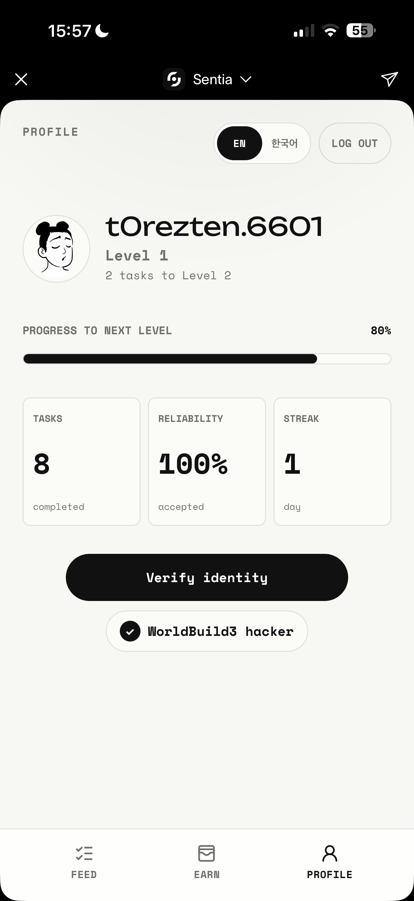
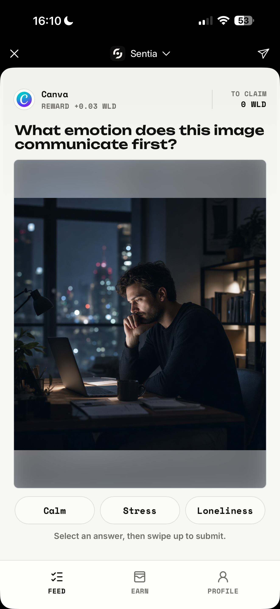

# SENTIA
Sentia connects real, verified humans to tasks that AI can’t solve — and pays them instantly.

Sentia turns human judgment into a fast, trusted workforce for AI teams: verified contributors complete lightweight tasks, earn in WLD, and build a reputation through reliability and streaks. The app is designed as a World Mini App, making identity verification and rewards feel native from the first tap.

World Mini App: https://sentia-nine.vercel.app/  
Open it from the World mobile app for the intended experience.

## What we built

- **World Mini App UX**: verified users can browse short AI-assistance tasks, answer with quick mobile-native interactions, and claim rewards once their work is accepted.
- **Feed and earn flow**: tasks are presented as focused cards with clear prompts, lightweight answer choices, and a swipe-style submission flow built for mobile speed.
- **Profile and reputation**: users can track level progress, completed tasks, reliability, streaks, and World ID verification status.
- **Reward vault**: the blockchain layer includes a Solidity vault contract for holding task reward liquidity and distributing payouts transparently from a controlled on-chain pool.

## App preview

  
  

## Hackathon context

Sentia was built during the WorldBuild3 hackathon. Developer experience notes and feedback from the build are collected in [`feedbacks/`](feedbacks/), including World Mini App feedback.
