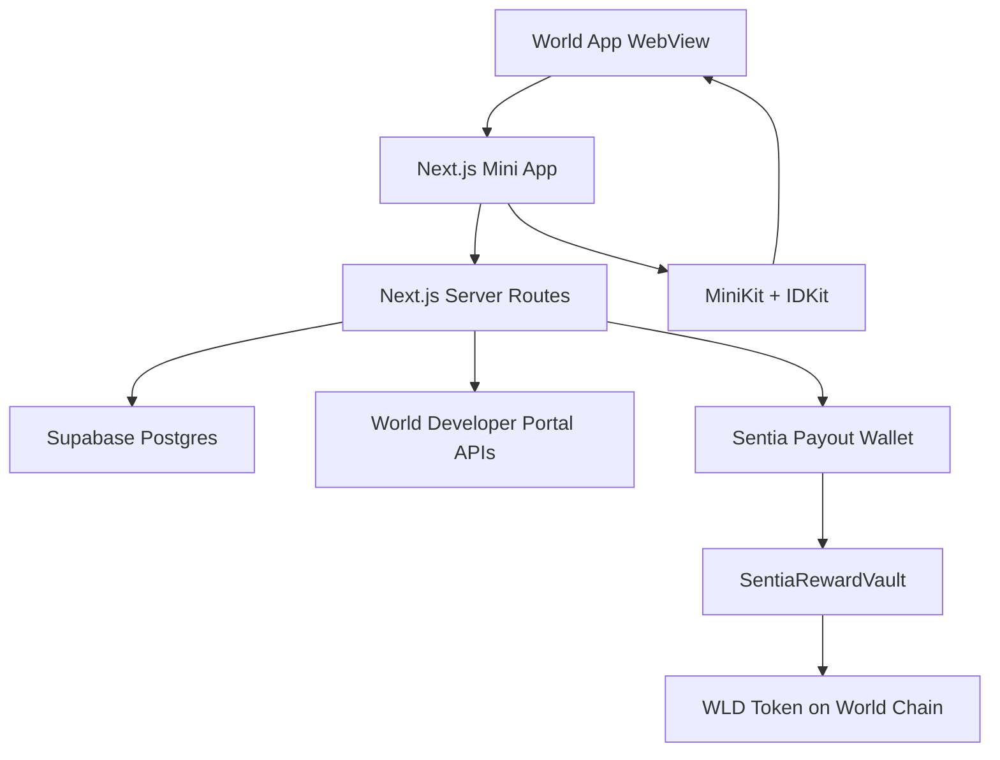
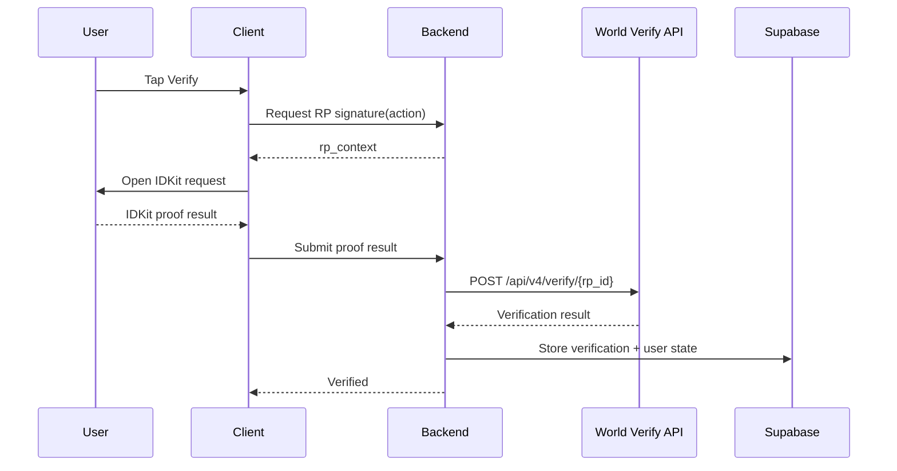
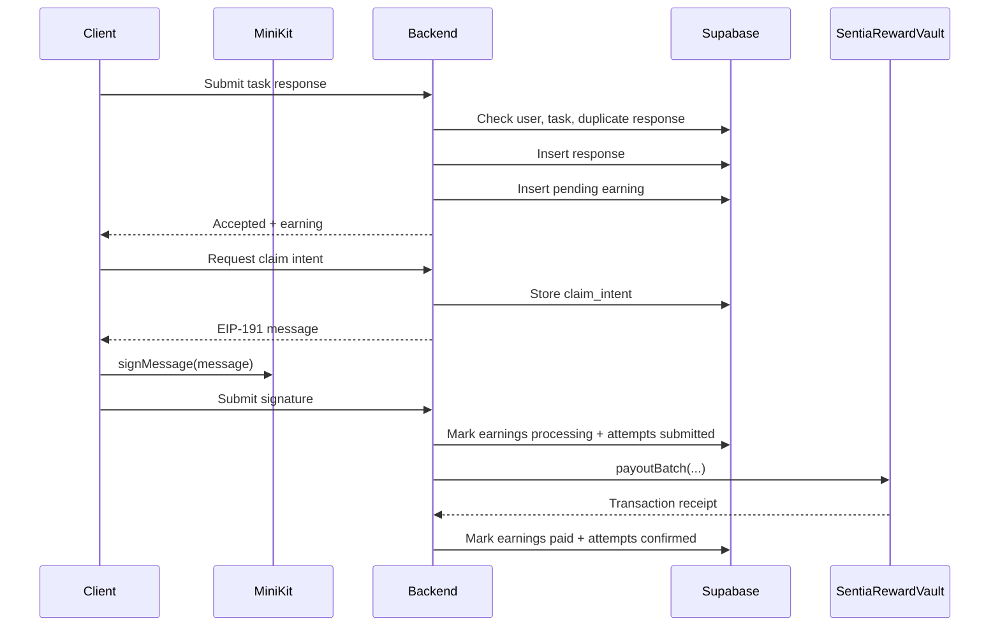

# Technical Architecture

## System Overview

Sentia uses Next.js for both the Mini App frontend and server routes that must keep secrets private. Supabase stores durable app state. World APIs verify humanity and wallet identity. Real rewards are paid from a pre-funded `SentiaRewardVault` contract on World Chain.

## Frontend Responsibilities

- Render the three-tab mobile UI: Feed, Earnings, Profile.
- Render Feed cards from task data returned by server routes.
- Initialize MiniKit with `MiniKitProvider`.
- Detect whether the app is running inside World App with `MiniKit.isInstalled()`.
- Start Wallet Auth when a wallet-linked session is required.
- Start IDKit verification from Profile.
- Submit task responses and render server-confirmed earning states.
- Request claim intents, call `MiniKit.signMessage`, and submit signatures.
- Never decide final verification, reward, or payout status locally.

## Backend Responsibilities

- Generate SIWE nonces and verify Wallet Auth payloads.
- Generate World ID 4.0 RP signatures using `RP_SIGNING_KEY`.
- Verify IDKit proof payloads against `POST https://developer.world.org/api/v4/verify/{rp_id}`.
- Enforce task completion rules.
- Create earnings ledger entries with the current payout mode and demo run.
- Create EIP-191 claim intents and verify World Wallet signatures.
- Execute WLD payouts from `SentiaRewardVault`.
- Reconcile submitted payouts from on-chain vault state.
- Use Supabase service role only from server-side code.

## Supabase Responsibilities

- Store users, verification records, tasks, responses, earnings, claim intents, payout attempts, and demo runs.
- Store task metadata and relative paths to static Feed card images.
- Separate mock and real reward state with `payout_mode`.
- Enforce uniqueness for task responses by task, user, payout mode, and demo run.
- Enforce uniqueness for World ID proof replay protection.
- Provide read APIs for mobile screens.
- Use RLS for direct client reads only if the Supabase anonymous key is exposed.

## API Boundary

Current server routes:

- `POST /api/auth/nonce`: create SIWE nonce.
- `POST /api/auth/complete-siwe`: verify Wallet Auth payload and create session.
- `POST /api/world/rp-signature`: sign IDKit RP context for a known action.
- `POST /api/world/verify-proof`: forward IDKit result to World and persist verification.
- `GET /api/tasks/feed`: return eligible tasks for the current payout mode/run.
- `POST /api/tasks/:taskId/responses`: validate and store task response.
- `GET /api/earnings`: return ledger and payout summary for the current mode/run.
- `GET /api/earnings/claim/intent`: create a real WLD claim message for MiniKit signature.
- `POST /api/earnings/claim`: claim mock earnings or execute a real vault payout.
- `POST /api/earnings/reconcile`: repair a submitted real payout from `vault.paid(...)`.
- `POST /api/demo-runs/start`: start a new real demo run without deleting real payouts.

Protected routes must identify the current user from a server-verified session, not from a client-submitted wallet address alone.

## Feed Demo Assets

Hackathon Feed card images are versioned in the repo and served by Next.js from `public/demo/feed-cards/images`.

Supabase does not store image blobs. `tasks.input_payload.image_path` stores the relative path used by the frontend, for example `/demo/feed-cards/images/1_ebay.png`.

`demo/feed-cards/feed-card-examples.csv` remains the source catalogue for future demo tasks. Only rows with existing image assets should be seeded into `tasks`.

## Verification Data Flow

## Task And Reward Data Flow

## Environment Variables

Client-safe:

- `NEXT_PUBLIC_WORLD_APP_ID`
- `NEXT_PUBLIC_WORLD_RP_ID`
- `NEXT_PUBLIC_SUPABASE_URL`
- `NEXT_PUBLIC_SUPABASE_ANON_KEY`

Server-only runtime:

- `WORLD_APP_ID`
- `WORLD_RP_ID`
- `RP_SIGNING_KEY`
- `SUPABASE_SERVICE_ROLE_KEY`
- `SUPABASE_URL`
- `WORLD_DEV_PORTAL_API_KEY`
- `WORLD_CHAIN_RPC_URL`
- `SENTIA_VAULT_ADDRESS`
- `SENTIA_PAYOUT_PRIVATE_KEY`
- `SENTIA_WLD_TOKEN_ADDRESS`
- `SENTIA_CHAIN_ID`

Deploy-time only:

- `SENTIA_DEPLOYER_PRIVATE_KEY`
- `SENTIA_VAULT_OWNER_ADDRESS`

Use public prefixes only for values intentionally exposed to the browser. The payout private key must never be exposed client-side.

## Deployment Assumptions

- Deploy Next.js to Vercel or another platform with server route support.
- Use Supabase hosted Postgres for the hackathon.
- Use World Chain mainnet only when the vault is funded and payout amounts are intentionally small.
- Keep the payout key server-only; it must be the current owner of `SentiaRewardVault`.
- Fund the vault manually with WLD before real claims.
- Add basic structured logging for proof verification, task completion, claim failures, and reconciliation.

