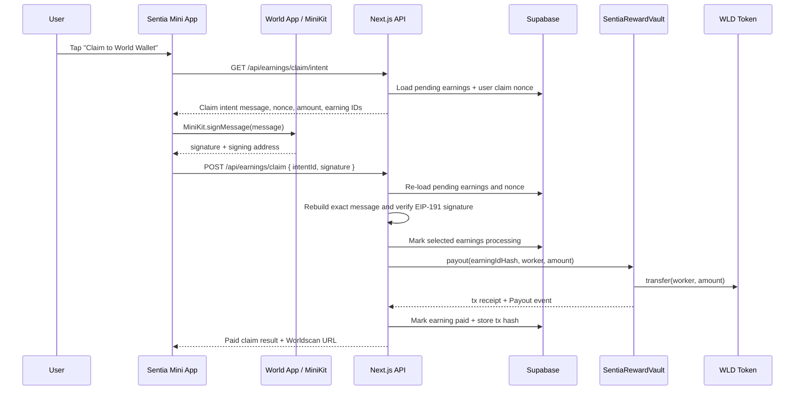

# World Chain Reward Vault Architecture

## Goal

Implement Sentia payout variant 2 for the hackathon demo:

> A verified worker claims earned WLD with an EIP-191 personal-message signature. Sentia's backend verifies the signed claim, then releases WLD from a minimal World Chain reward vault to the worker's World Wallet.

This keeps the demo concrete and on-chain while avoiding a full marketplace escrow system.

## Non-Goals

This design intentionally does **not** implement:

- campaign-level escrow
- company/requester deposits
- refunds
- dispute resolution
- on-chain task validation
- on-chain signature verification
- user-paid claim transactions
- `fund()` on the vault contract

The vault is funded operationally by manually transferring WLD to the contract address.

## Why This Variant

Variant 1, direct backend treasury transfer, is enough to pay users. Variant 2 adds a minimal smart contract vault because it improves the hackathon story without changing the core product logic too much.

Concrete benefits:

- WLD rewards are visibly held in a World Chain contract before payout.
- Each payout emits a public on-chain event.
- The contract prevents duplicate payouts for the same earning ID hash.
- The user explicitly authorizes the claim by signing an EIP-191 message in World App.
- The backend remains responsible for business logic, verification, and fraud checks.

Important limitation:

> The smart contract does not know whether a task response is valid. The backend remains trusted for task validation and payout authorization.

## Target Network

- Chain: World Chain mainnet
- Chain ID: `480`
- WLD token: `0x2cfc85d8e48f8eab294be644d9e25c3030863003`
- Explorer transaction URL: `https://worldscan.org/tx/{txHash}`

## High-Level Flow



## Components

### 1. Smart Contract: `SentiaRewardVault`

The contract only holds WLD and pays workers when called by the owner.

Required properties:

- immutable WLD token address
- owner address controlled by the backend payout wallet
- `mapping(bytes32 => bool) paid`
- `payout(bytes32 earningIdHash, address worker, uint256 amount)`
- `Payout` event
- no `fund()` function

Minimal Solidity shape:

```solidity
// SPDX-License-Identifier: MIT
pragma solidity ^0.8.24;

interface IERC20 {
    function transfer(address to, uint256 amount) external returns (bool);
    function balanceOf(address account) external view returns (uint256);
}

contract SentiaRewardVault {
    IERC20 public immutable wld;
    address public owner;

    mapping(bytes32 => bool) public paid;

    event OwnershipTransferred(address indexed previousOwner, address indexed newOwner);
    event Payout(bytes32 indexed earningIdHash, address indexed worker, uint256 amount);

    error NotOwner();
    error AlreadyPaid();
    error InvalidWorker();
    error InvalidAmount();
    error TransferFailed();

    modifier onlyOwner() {
        if (msg.sender != owner) revert NotOwner();
        _;
    }

    constructor(address wldToken, address initialOwner) {
        if (wldToken == address(0)) revert InvalidWorker();
        if (initialOwner == address(0)) revert InvalidWorker();
        wld = IERC20(wldToken);
        owner = initialOwner;
        emit OwnershipTransferred(address(0), initialOwner);
    }

    function transferOwnership(address newOwner) external onlyOwner {
        if (newOwner == address(0)) revert InvalidWorker();
        emit OwnershipTransferred(owner, newOwner);
        owner = newOwner;
    }

    function payout(bytes32 earningIdHash, address worker, uint256 amount) external onlyOwner {
        if (paid[earningIdHash]) revert AlreadyPaid();
        if (worker == address(0)) revert InvalidWorker();
        if (amount == 0) revert InvalidAmount();

        paid[earningIdHash] = true;

        bool ok = wld.transfer(worker, amount);
        if (!ok) revert TransferFailed();

        emit Payout(earningIdHash, worker, amount);
    }

    function balance() external view returns (uint256) {
        return wld.balanceOf(address(this));
    }
}
```

Notes:

- There is intentionally no `fund()` function.
- Funding is done by transferring WLD directly to the vault address.
- The `paid` mapping is set before transfer. If the transfer reverts, the whole transaction reverts and `paid` is not persisted.
- The contract has no concept of tasks, campaigns, users, or World ID. Those stay in the backend.

### 2. EIP-191 Claim Authorization

World Mini Apps support `MiniKit.signMessage()` for EIP-191 personal-message signatures.

The signature is used as an off-chain authorization. The backend verifies it before paying from the vault.

The smart contract does not verify this signature.

#### Message Requirements

The message must be deterministic and rebuilt exactly on the backend.

It must include:

- app name
- action
- user wallet
- vault address
- chain ID
- WLD token address
- sorted earning IDs hash
- total amount in WLD wei
- nonce
- deadline

Recommended message format:

```txt
Sentia Claim Authorization

Action: Claim WLD rewards
Wallet: {userWalletAddressLowercase}
Vault: {vaultAddressLowercase}
Chain ID: 480
Token: WLD
Token Address: 0x2cfc85d8e48f8eab294be644d9e25c3030863003
Earnings Hash: {earningIdsHash}
Amount Wei: {totalAmountWei}
Nonce: {claimNonce}
Deadline: {unixDeadlineSeconds}

Only sign this message inside Sentia if you intend to claim these rewards to your World Wallet.
```

Address casing must be normalized before rendering and verification. Use lowercase hex strings for message fields, while still using checksum/address validation for blockchain calls.

#### Earnings Hash

For a batch claim, the user signs a hash of the sorted earning IDs instead of every ID rendered inline.

Recommended helper:

```ts
import { keccak256, toBytes } from "viem";

export function buildEarningIdsHash(earningIds: string[]) {
  const sorted = [...earningIds].sort();
  return keccak256(toBytes(JSON.stringify(sorted)));
}
```

The backend must recompute this from the earnings it is actually going to pay. Never trust the client-submitted amount or earning IDs without reloading from the database.

#### Nonce

Add a per-user claim nonce.

```sql
alter table users
  add column if not exists claim_nonce bigint not null default 0;
```

Rules:

- The claim intent uses the current `users.claim_nonce`.
- The backend accepts a signature only if the nonce still matches.
- After a successful claim transaction, increment `claim_nonce`.
- If a claim fails before any on-chain payout, the nonce may remain unchanged so the user can retry.
- If partial payouts are possible, increment the nonce after finalizing the claim attempt and return per-earning results.

For the hackathon implementation, prefer all-or-clear batch handling where possible.

#### Deadline

Use a short expiry, for example 10 minutes:

```ts
const deadline = Math.floor(Date.now() / 1000) + 10 * 60;
```

The backend rejects expired signatures.

### 3. API Design

#### `GET /api/earnings/claim/intent`

Creates the exact message that the user will sign.

Responsibilities:

1. Authenticate the current user from the existing server session.
2. Confirm the user has a valid `wallet_address`.
3. Confirm the user is World ID verified / eligible to claim.
4. Load all claimable `pending` earnings for the user.
5. Sort earning IDs.
6. Calculate `earningIdsHash`.
7. Calculate `totalAmountWei` from database values.
8. Read `users.claim_nonce`.
9. Build deterministic EIP-191 message.
10. Return the message and display metadata to the client.

Response shape:

```json
{
  "message": "Sentia Claim Authorization\n\nAction: Claim WLD rewards\n...",
  "claim": {
    "earningIds": ["..."],
    "earningIdsHash": "0x...",
    "amountWei": "25000000000000000",
    "amountFormatted": "0.025",
    "nonce": 12,
    "deadline": 1777200000,
    "vaultAddress": "0x...",
    "chainId": 480,
    "tokenAddress": "0x2cfc85d8e48f8eab294be644d9e25c3030863003"
  }
}
```

No database state should be changed by this endpoint.

#### `POST /api/earnings/claim`

Consumes the signature and executes payouts.

Request shape:

```json
{
  "signature": "0x...",
  "message": "Sentia Claim Authorization\n\nAction: Claim WLD rewards\n..."
}
```

The backend should not trust the submitted message. It should rebuild the expected message from database state and compare it byte-for-byte.

Processing steps:

1. Authenticate current user.
2. Re-load user wallet, verification status, and `claim_nonce`.
3. Re-load current claimable `pending` earnings.
4. Recompute earning IDs, hash, total amount, deadline rules, and expected message.
5. Check submitted message equals expected message.
6. Verify EIP-191 signature using `verifyMessage` from `viem`.
7. Confirm recovered/signed address equals `users.wallet_address`.
8. Move selected earnings from `pending` to `processing`.
9. For each earning, call `SentiaRewardVault.payout(earningIdHash, worker, amountWei)`.
10. Wait for transaction receipt.
11. Mark earning `paid` with transaction metadata.
12. Increment `users.claim_nonce` after successful finalization.
13. Return per-earning payout results.

For the first implementation, paying each earning separately is simpler and gives one anti-double-pay guard per ledger row. A later optimization can batch payouts in the vault.

### 4. Backend Payout Service

Create a server-only service, for example:

```txt
lib/payouts/world-chain-vault.ts
```

Responsibilities:

- create `publicClient` for World Chain
- create `walletClient` from `SENTIA_PAYOUT_PRIVATE_KEY`
- encode `payout(...)` calls using the vault ABI
- wait for receipts
- return tx hashes and errors

Required environment variables:

```env
WORLD_CHAIN_RPC_URL=
SENTIA_VAULT_ADDRESS=
SENTIA_PAYOUT_PRIVATE_KEY=
SENTIA_WLD_TOKEN_ADDRESS=0x2cfc85d8e48f8eab294be644d9e25c3030863003
SENTIA_CHAIN_ID=480
```

Operational constraint:

- `SENTIA_PAYOUT_PRIVATE_KEY` must correspond to the vault `owner`, or payouts will revert with `NotOwner()`.

### 5. Database Changes

Add payout metadata to `earnings_ledger`:

```sql
alter table earnings_ledger
  add column if not exists chain_id integer default 480,
  add column if not exists recipient_wallet text,
  add column if not exists payout_contract_address text,
  add column if not exists payout_tx_hash text,
  add column if not exists payout_error text,
  add column if not exists paid_at timestamptz;

create unique index if not exists earnings_ledger_payout_tx_hash_idx
on earnings_ledger(payout_tx_hash)
where payout_tx_hash is not null;
```

Add claim nonce to `users`:

```sql
alter table users
  add column if not exists claim_nonce bigint not null default 0;
```

Recommended ledger state transitions:

```txt
pending -> processing -> paid
pending -> processing -> failed
failed -> processing -> paid, only on explicit retry
```

Do not mark an earning `paid` until a transaction receipt confirms success.

### 6. Frontend Claim UX

In the Earnings tab:

1. User taps `Claim to World Wallet`.
2. Client calls `GET /api/earnings/claim/intent`.
3. Client shows a short confirmation state if useful.
4. Client calls `MiniKit.signMessage({ message })`.
5. Client posts `{ message, signature }` to `POST /api/earnings/claim`.
6. UI shows `Sending on World Chain...` while backend executes payout.
7. UI renders paid results with Worldscan links.

MiniKit shape from World docs:

```ts
const result = await MiniKit.signMessage({
  message,
});

if (result.executedWith === "minikit" && result.data.status === "success") {
  const signature = result.data.signature;
  const address = result.data.address;
}
```

The frontend must not calculate the authoritative amount. It can display server-provided metadata, but the backend recalculates everything before paying.

### 7. Security Rules

Backend must enforce:

- authenticated user only
- verified human / eligible user only
- signer address equals stored wallet address
- wallet address is valid and non-zero
- nonce matches current `users.claim_nonce`
- deadline not expired
- message equals backend rebuilt message exactly
- earnings belong to the user
- earnings are currently `pending`
- total amount equals the sum of DB reward amounts
- vault address and chain ID match environment
- payout private key is never exposed to the client

Contract enforces:

- only owner can pay
- no duplicate payout for the same `earningIdHash`
- no zero worker
- no zero amount
- WLD transfer must succeed

### 8. Failure Handling

Common failures and handling:

| Failure | Handling |
| --- | --- |
| User rejects signature | Keep earnings `pending`; show cancelled state. |
| Signature invalid | Return 401/400; keep earnings `pending`. |
| Nonce mismatch | Return conflict; client should fetch a new intent. |
| No pending earnings | Return empty claim result; no signature needed. |
| Vault underfunded | Mark processing earnings `failed` or revert to `pending`; store error. |
| RPC timeout before receipt | Store tx hash if known; add reconciliation job/manual check. |
| Contract `AlreadyPaid()` | Treat as suspicious; check DB and vault event state before retrying. |

For demo reliability, the vault should be funded with more WLD than the expected total demo payouts.

### 9. Deployment Steps

1. Add Solidity tooling, preferably Foundry or Hardhat.
2. Implement `SentiaRewardVault.sol` with no `fund()` function.
3. Add a deploy script for World Chain mainnet.
4. Deploy with constructor args:

```txt
wldToken = 0x2cfc85d8e48f8eab294be644d9e25c3030863003
initialOwner = payout backend wallet address
```

5. Save deployed address as `SENTIA_VAULT_ADDRESS`.
6. Manually transfer a small amount of WLD to the vault address.
7. Confirm `balance()` returns the expected WLD amount.
8. Add backend env vars locally and in Vercel.
9. Run database migrations.
10. Test one claim from a real World Wallet.
11. Verify transaction on Worldscan.
12. Test duplicate claim behavior.

### 10. Implementation Order

Recommended sequence:

1. Add DB migration for payout fields and `users.claim_nonce`.
2. Add vault ABI in `lib/contracts/sentiaRewardVaultAbi.ts`.
3. Add claim-message helpers in `lib/earnings/claim-message.ts`.
4. Add backend signature verification helper using `verifyMessage`.
5. Add `GET /api/earnings/claim/intent`.
6. Add `SentiaRewardVault.sol` and deploy script.
7. Deploy vault and fund it manually with WLD.
8. Add `lib/payouts/world-chain-vault.ts`.
9. Upgrade `POST /api/earnings/claim` to verify signature and execute payouts.
10. Update Earnings UI to call intent, sign message, submit claim, and show tx links.
11. Add a small admin/debug check for vault balance if time allows.
12. Run build and test a full claim end-to-end.

### 11. Acceptance Criteria

The implementation is complete when:

- A verified user can complete a task and receive a pending earning.
- The Earnings tab shows a claim button for pending WLD.
- Tapping claim opens a World App EIP-191 signature prompt.
- The backend verifies the signature against the stored wallet address.
- The backend calls `SentiaRewardVault.payout(...)` on World Chain.
- The user receives WLD in their World Wallet.
- The earning is marked `paid` with `payout_tx_hash`, `recipient_wallet`, `chain_id`, `payout_contract_address`, and `paid_at`.
- The UI links to the Worldscan transaction.
- Re-clicking claim does not pay the same earning again.

### 12. Pitch Summary

For the hackathon, describe this as:

> Sentia uses World ID to verify that workers are real humans, then records their task earnings in a backend ledger. When a worker claims, they sign an EIP-191 authorization in World App. Sentia verifies the signature server-side and releases WLD from a pre-funded World Chain reward vault. The vault provides public proof of funds, on-chain payout events, and duplicate payout protection while keeping task validation off-chain for speed and flexibility.
