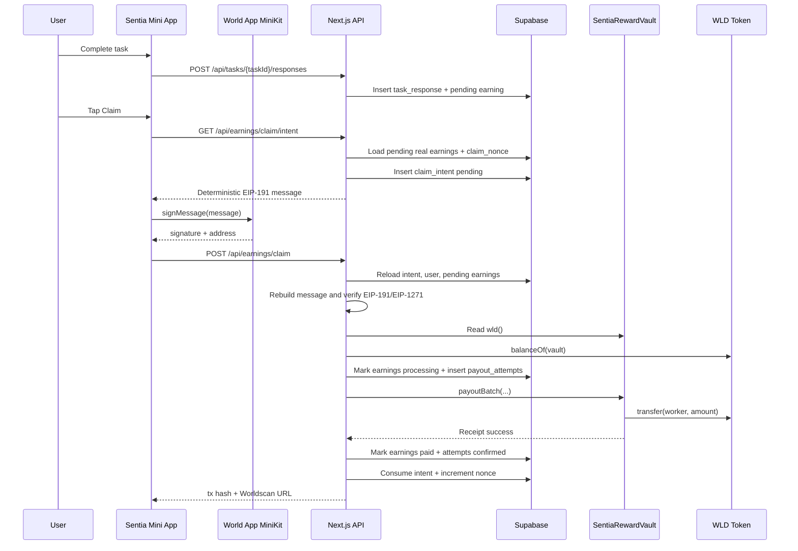

# World Chain Reward Vault Architecture

## Goal

Sentia's hackathon payout path pays real WLD from a pre-funded World Chain smart contract after a worker signs a claim authorization inside World App.

The current implementation is intentionally focused:

- verified or builder-approved workers complete off-chain tasks;
- Sentia records earnings in Supabase;
- workers sign an EIP-191 claim intent with `MiniKit.signMessage`;
- Sentia's backend verifies the signature and releases WLD from `SentiaRewardVault`;
- the vault provides public on-chain funds, payout events, and duplicate payout protection.

This is not yet a full requester escrow marketplace. It is a credible, demo-ready payout rail for real WLD rewards.

## Current Hackathon Scope

Implemented:

- World Chain mainnet payout vault.
- Real WLD batch payouts via `payoutBatch`.
- EIP-191 claim authorization.
- EOA recovery plus EIP-1271 fallback for World Wallet signatures.
- Mock vs real payout separation in the database.
- Reconciliation endpoint for post-transaction DB recovery.
- Real demo runs for repeatable production demos.

Not implemented in the hackathon contract:

- requester-funded campaign escrow;
- requester refunds;
- dispute resolution;
- on-chain task validation;
- on-chain signature verification;
- user-paid claim transactions.

Those are product evolution steps, not blockers for the current demo loop.

## Target Network

- Chain: World Chain mainnet
- Chain ID: `480`
- WLD token: `0x2cfc85d8e48f8eab294be644d9e25c3030863003`
- Explorer transaction URL: `https://worldscan.org/tx/{txHash}`

## Smart Contract

`SentiaRewardVault` holds WLD and pays workers when called by its owner, which is the backend payout wallet.

Core contract behavior:

- `IERC20 public immutable wld`
- `address public owner`
- `mapping(bytes32 => bool) public paid`
- `payout(bytes32 earningIdHash, address worker, uint256 amount)`
- `payoutBatch(bytes32[] earningIdHashes, address[] workers, uint256[] amounts)`
- `withdrawWld(address to, uint256 amount)`
- `balance()`
- `Payout` and `Withdraw` events

The batch payout is atomic: if any earning hash is already paid, any amount is zero, any worker is zero, or WLD transfer fails, the whole transaction reverts.

The `paid[earningIdHash]` mapping prevents paying the same earning hash twice on-chain. The hash is currently:

```ts
keccak256(toBytes(earningId))
```

There is intentionally no `fund()` function. Funding is done by transferring WLD directly to the vault address. This keeps the contract simple and compatible with normal ERC-20 transfer UX.

## Real Claim Flow



### Claim Intent

`GET /api/earnings/claim/intent` only works in real mode.

It:

1. Authenticates the current user.
2. Allows claim access for `verification_status = verified` or `builder_access_status = granted`.
3. Loads the user's pending real WLD earnings in the current demo run.
4. Sorts earning IDs and computes `earningIdsHash`.
5. Sums WLD amounts with string/BigInt math.
6. Reads `users.claim_nonce`.
7. Builds a deterministic EIP-191 message.
8. Stores a short-lived `claim_intents` row.

The user signs a message shaped like:

```txt
Sentia Claim Authorization

Action: Claim WLD rewards
Wallet: {userWalletAddressLowercase}
Vault: {vaultAddressLowercase}
Chain ID: 480
Token: WLD
Token Address: 0x2cfc85d8e48f8eab294be644d9e25c3030863003
Earnings Hash: {earningIdsHash}
Amount Wei: {totalAmountWei}
Nonce: {claimNonce}
Deadline: {unixDeadlineSeconds}

Only sign this message inside Sentia if you intend to claim these rewards to your World Wallet.
```

The client never decides the final amount, earning IDs, nonce, token, or vault.

### Claim Execution

`POST /api/earnings/claim` in real mode accepts:

```json
{
  "intentId": "...",
  "message": "...",
  "signature": "0x...",
  "address": "0x..."
}
```

The backend:

- reloads the stored intent and current user;
- rejects expired or consumed intents;
- checks the wallet and claim nonce still match;
- reloads pending real WLD earnings from the database;
- rebuilds the exact message and compares byte-for-byte;
- verifies EIP-191 through EOA recovery or EIP-1271 `isValidSignature`;
- preflights the vault:
  - `SENTIA_CHAIN_ID = 480`;
  - `SENTIA_VAULT_ADDRESS` is non-zero;
  - `SENTIA_PAYOUT_PRIVATE_KEY` is present;
  - `vault.wld()` equals `SENTIA_WLD_TOKEN_ADDRESS`;
  - `WLD.balanceOf(vault)` covers the batch amount;
- marks selected earnings `processing`;
- inserts `payout_attempts` with `status = submitted`;
- calls `payoutBatch`;
- on receipt success, marks earnings `paid`, attempts `confirmed`, consumes the intent, and increments `claim_nonce`.

If a failure happens before any transaction is submitted, earnings return to `pending` so the user can retry.

If a transaction is submitted but DB finalization fails, earnings keep `processing` plus `payout_tx_hash`. Reconciliation can repair the database from the on-chain vault state.

## Reconciliation

`POST /api/earnings/reconcile` is a minimal recovery route for real mode.

It can reconcile:

- a specific `{ txHash }`; or
- the current user's processing payouts in the current real demo run.

The helper reads relevant real earnings and checks the contract directly:

```ts
vault.paid(buildVaultEarningIdHash(earning.id))
```

Only if every earning in the target batch is paid on-chain does it finalize the database:

- `earnings_ledger.status = paid`
- `payout_attempts.status = confirmed`
- pending claim intent consumed when found
- nonce incremented when still matching

This makes the on-chain `paid` mapping the recovery source of truth for payout finalization.

## Mock vs Real Separation

The app can run with mock WLD or real WLD against the same Supabase project.

- `NEXT_PUBLIC_SENTIA_MOCK_ADMIN=true` creates and claims mock earnings.
- Normal `pnpm run dev` creates real earnings and uses the World Chain vault.
- `task_responses.payout_mode` and `earnings_ledger.payout_mode` separate the two modes.
- Mock admin reset/pay actions only touch mock rows.
- Real payouts never process mock earnings.

Historical test data is treated as mock so old demo rows cannot accidentally become real payable rewards.

## Real Demo Runs

Real paid earnings should not be deleted or reset. They are already part of the worker ledger and may also be paid on-chain.

For repeatable production demos, Sentia uses `demo_runs`:

- `users.current_demo_run_id` selects the active real run;
- `task_responses.demo_run_id` records completions per run;
- `earnings_ledger.demo_run_id` scopes real rewards per run;
- Feed excludes tasks completed only in the current run;
- Earnings/Profile default to the current run.

Starting a new real demo run makes the same seeded tasks available again while preserving previous real payouts.

## Environment Variables

Runtime server variables:

```env
WORLD_CHAIN_RPC_URL=https://worldchain-mainnet.g.alchemy.com/public
SENTIA_VAULT_ADDRESS=0x...
SENTIA_PAYOUT_PRIVATE_KEY=0x...
SENTIA_WLD_TOKEN_ADDRESS=0x2cfc85d8e48f8eab294be644d9e25c3030863003
SENTIA_CHAIN_ID=480
```

Deploy-time variables:

```env
SENTIA_DEPLOYER_PRIVATE_KEY=0x...
SENTIA_VAULT_OWNER_ADDRESS=0x...
```

`SENTIA_DEPLOYER_PRIVATE_KEY` is only needed to deploy the contract. Runtime payouts use `SENTIA_PAYOUT_PRIVATE_KEY`, which must correspond to the current vault owner.

## Deployment Steps

1. Configure `SENTIA_DEPLOYER_PRIVATE_KEY`, `SENTIA_VAULT_OWNER_ADDRESS`, `WORLD_CHAIN_RPC_URL`, `SENTIA_WLD_TOKEN_ADDRESS`, and `SENTIA_CHAIN_ID`.
2. Run `pnpm compile:vault`.
3. Deploy with `pnpm deploy:vault`.
4. Store the deployed contract address as `SENTIA_VAULT_ADDRESS`.
5. Configure runtime `SENTIA_PAYOUT_PRIVATE_KEY`.
6. Transfer a small WLD amount to the vault.
7. Run one real claim end-to-end.
8. Check the tx on Worldscan and verify the earning becomes `paid`.
9. If the tx succeeds but the UI remains `processing`, call `/api/earnings/reconcile`.

Use Node 22 LTS for Hardhat deploys.

## Hackathon Limitations

The current architecture is deliberately compact:

- The backend is trusted for task validation and payout authorization.
- The vault is pre-funded by Sentia, not by individual requesters.
- Companies in the demo are represented by seeded tasks, not requester accounts with escrowed budgets.
- The owner payout key is server-side custodial infrastructure.
- Refunds, disputes, campaign accounting, and requester billing are off-chain or out of scope for the hackathon.

This is a good fit for the demo: judges can see World ID, human task completion, an explicit World Wallet signature, real WLD moving from a World Chain contract, and public on-chain payout evidence.

## Production-Ready Evolution

A production marketplace would move requester funding and campaign accounting on-chain.

One possible architecture:

- `CampaignFactory` creates campaign escrow contracts for companies.
- Each `CampaignEscrow` stores requester, budget, token, reward rules, expiration, and refund policy.
- Companies deposit WLD before tasks go live.
- Sentia's backend keeps the task UX, matching, validation, anti-fraud checks, and quality review in Supabase.
- After validated work, the backend or an attester service submits payout batches against the campaign escrow.
- The escrow releases WLD to workers and records paid task or earning hashes on-chain.
- Expired unused funds can be refunded to the company according to campaign rules.
- Higher-value campaigns can require multisig approval, optimistic challenge windows, or an oracle/attestation layer before payout.

In that model, Sentia's backend becomes the orchestrator and attester of off-chain work, while contracts hold requester funds, enforce budget boundaries, prevent double payouts, and make refunds/audits explicit. The current reward vault is a practical first step toward that system: it proves the worker payout rail and on-chain duplicate protection without requiring the full requester escrow surface during the hackathon.

